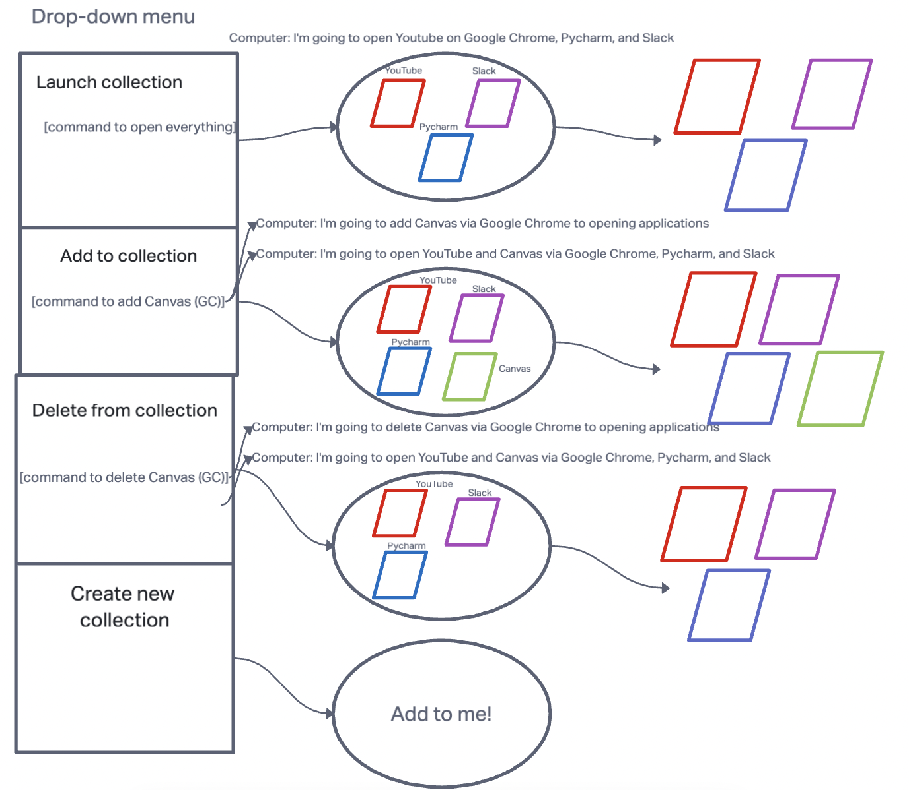
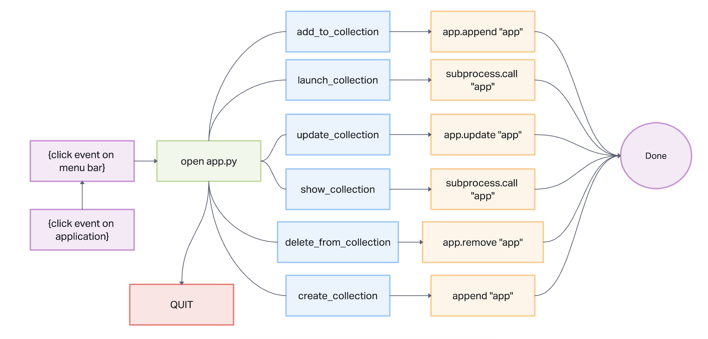

# PyCruise 2.0

## Authors

Liesl White  

Dominic Giacona  

Dennis DeVries  

Brentice Loper  

Jamall Malik  

## Project Management Tools:

[GitHub Organization: PyCruisers](https://github.com/Py-Cruisers)

[Trello: Residio](https://trello.com/b/wlGamE96/residio)

## Project Prep

1. [Team Agreement](project-preps/prep-1.md)
2. [Prepare Your Projects](project-preps/prep-2)
3. [User Stories](project-preps/prep-4)
4. [Software Requirements](project-preps/requirements.md)  

## Graphs/Charts Below

### Flowchart  



### Domain Model



## Testing

### Pytest-qt Research Notes

- Pytest-qt plugin
  - allows programmers to write tests for PyQt5 and PyQt6, among others
  - main use is `qtbot` fixture (see below)
    - handles `qApp` creation
    - provides methods to simulate user interaction with Qt widgets
      - eg. key presses and mouse clicks

```Python
def test_hello(qtbot):
    widget = HelloWidget()
    qtbot.addWidget(widget)

    # click in the Greet button and make sure it updates the appropriate label
    qtbot.mouseClick(widget.button_greet, QtCore.Qt.LeftButton)

    assert widget.greet_label.text() == "Hello!"
```

- Requirements

  - Minimum Python3.7
    - works with PySide6, PySide2, <em>PyQt6</em>, <em>PyQt5</em>
    - gives preference to first one installed in this order:
      - PySide6
      - PySide 2
      - PyQt6
      - PyQt5

  ```md
  Note: Over the course of this project we used only PyQt5 and PyQt6. We did not use PySide.
  ```

### References

- [PyTest Qt Tutorial](https://pytest-qt.readthedocs.io/en/latest/tutorial.html)

- [Using PyTest Temporary Directories](https://pytest.org/en/7.1.x/how-to/tmp_path.html)

- [Test Tutorial Example Code](https://github.com/nicoddemus/PySide-Examples/blob/master/examples/dialogs/findfiles.py)

- [PyQt Testing StackOverflow](https://stackoverflow.com/questions/15044447/how-do-i-unit-testing-my-gui-program-with-python-and-pyqt)

- [PyTest "0 tests ran" error solution](https://stackoverflow.com/questions/34363388/pytest-no-tests-ran)